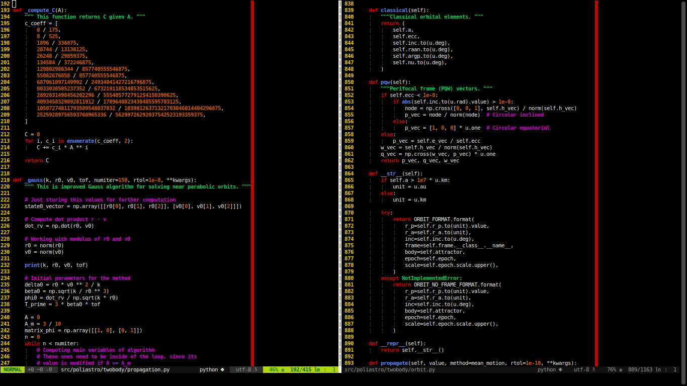

# Volk colorscheme for vim


Volk is a colorscheme designed for Vim to highlight Python syntax a really
colorful way. I decided to develope it by my own and adapt it to my needs.
Its background dependes on how your terminal colors are configurated. I
strongly suggest you to use a true black background to have fun with this Vim
theme.

The plugin is still under development. Everyday I learn something new in Vim
and therefore this package is supposed to improve along time. Some future
ideas would be:

* Better color self and instances
* Use of regular expressions for matching string patterns
* Create a custom python_syntax.vim for the plugin

## Installation

You can easily install Volk by adding the following to your .vimrc file:

```vim
Plugin 'jorgepiloto/volk'
```


## Screenshot


